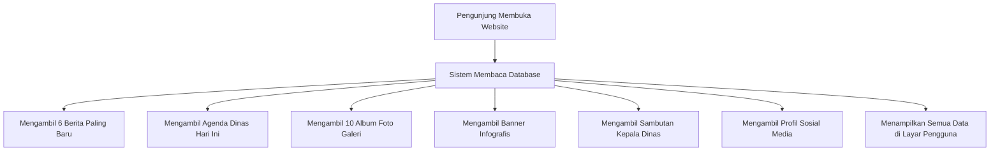
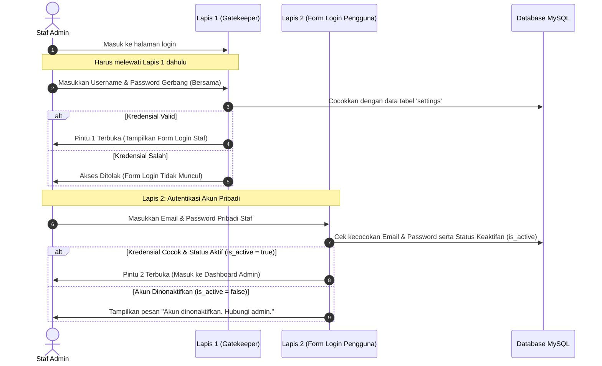

# DOKUMEN PENJELASAN SISTEM & ALUR KERJA PORTAL DINKES CIANJUR
## (Panduan Presentasi & Referensi Sistem)

Dokumen ini menjelaskan bagaimana website Dinas Kesehatan Kabupaten Cianjur bekerja, mulai dari penyimpanan data (database), tampilan halaman utama, hingga sistem keamanan login. Dokumen ini ditulis dengan bahasa yang sederhana agar mudah dipahami untuk kebutuhan presentasi.

---

## 1. Penyimpanan Data (Database MySQL)

Aplikasi ini menggunakan **1 Database Utama** berbasis **MySQL** yang dijalankan melalui aplikasi **XAMPP Control Panel**. Database ini dinamakan `dinkes_cianjur`.

> [!NOTE]
> Database telah dibersihkan dari file database SQLite tidak terpakai (`database.sqlite`) serta 90+ tabel sisa pengujian proyek lain. Sekarang, database hanya berisi tabel-tabel murni milik sistem portal Dinas Kesehatan Cianjur.

Bayangkan database ini seperti sebuah **Lemari Arsip Besar**. Di dalam lemari ini terdapat **27 Laci/Map Penyimpanan (Tabel)** aktif:

| No | Nama Tabel | Fungsi Utama (Apa yang Disimpan?) |
|----|------------|-----------------------------------|
| 1 | `users` | Akun staf dan administrator (Nama, Email, Password, Status Keaktifan). |
| 2 | `beritas` | Artikel berita dan kegiatan dinas yang dipublikasikan ke masyarakat. |
| 3 | `agendas` | Agenda kerja dinas yang tampil di kalender halaman depan. |
| 4 | `galeris` | Album foto kegiatan dinas (misal: "Kegiatan Imunisasi Balita"). |
| 5 | `galeri_photos` | File foto-foto di dalam setiap album galeri. |
| 6 | `profiles` | Profil umum dinas (Sejarah, Visi, Misi, Struktur Organisasi). |
| 7 | `statistik_settings` | Angka statistik kesehatan (jumlah puskesmas, dokter, posyandu, dll). |
| 8 | `stunting_records` | Data perkembangan stunting di Cianjur dari tahun ke tahun. |
| 9 | `settings` | Pengaturan umum website (termasuk password gerbang masuk/Gatekeeper). |
| 10 | `laporans` | Dokumen laporan dinas (Laporan Kinerja, Laporan Keuangan). |
| 11 | `regulasis` | Dokumen hukum kesehatan (Undang-Undang, Peraturan Bupati). |
| 12 | `layanan_terpadus` | Daftar layanan kesehatan masyarakat yang disediakan dinas. |
| 13 | `program_kesehatans` | Detail program kesehatan dinas (seperti Program KIA, Imunisasi). |
| 14 | `ppid_settings` | Informasi halaman PPID (Pejabat Pengelola Informasi & Dokumentasi). |
| 15 | `labkesda_settings` | Profil singkat, kontak, dan jam operasional Labkesda. |
| 16 | `labkesda_categories` | Kategori jenis pemeriksaan Labkesda (Kimia Klinik, Hematologi, dll). |
| 17 | `labkesda_items` | Jenis pemeriksaan detail beserta tarif rupiahnya. |
| 18 | `pagoda_sehat_cards` | Kartu info portal kesehatan "Pagoda Sehat" (Pasar Go Digital Sehat). |
| 19 | `faskes` | Daftar rumah sakit dan puskesmas beserta koordinat peta lokasinya. |
| 20 | `info_cards` | Kartu info statistik cepat di halaman depan. |
| 21 | `social_links` | Akun media sosial resmi dinas (Instagram, YouTube, dll). |
| 22 | `kategoris` | Pilihan kategori untuk berita, program, regulasi, dan laporan. |
| 23 | `jenis_faskes` | Pilihan tipe faskes (Puskesmas vs Rumah Sakit). |
| 24 | `kecamatans` | Daftar nama kecamatan yang ada di Kabupaten Cianjur. |
| 25 | `ikm_ratings` | Penilaian bintang dan ulasan dari masyarakat tentang dinas. |
| 26 | `header_settings` | Pengaturan logo dan nama dinas di bagian atas website. |
| 27 | `infografis` | Gambar infografis/banner edukasi kesehatan di halaman depan. |

---

### Detail Kolom pada Setiap Tabel (Skema Kolom Database)

Berikut adalah detail daftar kolom (field) dari masing-masing tabel database untuk kebutuhan referensi teknis presentasi:

#### 1. `users` (Data Akun Staf/Admin)
* `id` (bigint): Kunci utama unik akun.
* `name` (varchar): Nama lengkap pengguna.
* `email` (varchar): Alamat email (digunakan untuk login).
* `password` (varchar): Password yang disandi (hash).
* `is_admin` (tinyint): Penentu hak akses admin (1 = Administrator Utama, 0 = Staf Biasa).
* `is_active` (tinyint): Status keaktifan (1 = Aktif bisa login, 0 = Diblokir).

#### 2. `beritas` (Berita Dinas)
* `id` (bigint): Kunci utama berita.
* `title` (varchar): Judul artikel berita.
* `slug` (varchar): Tautan URL ramah search engine (SEO slug).
* `category` (varchar): Nama kategori berita.
* `content` (text): Isi lengkap tulisan berita.
* `image` (varchar): File path foto utama berita.
* `views` (int): Jumlah pembaca berita.
* `status` (varchar): Status penayangan (`published` atau `draft`).

#### 3. `agendas` (Agenda Kerja Dinas)
* `id` (bigint): Kunci utama agenda.
* `title` (varchar): Nama/Judul agenda dinas.
* `date` (date): Tanggal pelaksanaan kegiatan.
* `time_start` (varchar): Waktu mulai acara (contoh: "08:00").
* `time_end` (varchar): Waktu selesai acara.
* `location` (varchar): Lokasi tempat acara berlangsung.
* `description` (text): Penjelasan atau detail agenda.
* `status` (varchar): Status tampil (`published` atau `draft`).

#### 4. `galeris` (Album Galeri)
* `id` (bigint): Kunci utama galeri.
* `title` (varchar): Judul album galeri.
* `slug` (varchar): Tautan URL album.
* `image` (varchar): File path foto sampul album.
* `category` (varchar): Kategori galeri.

#### 5. `galeri_photos` (Foto Detail di Galeri)
* `id` (bigint): Kunci utama foto.
* `galeri_id` (bigint): Kunci tamu relasi ke `galeris.id`.
* `image` (varchar): File path gambar foto tersebut.
* `is_thumbnail` (tinyint): Status foto utama (1 = Ya, 0 = Tidak).
* `order` (int): Pengatur urutan tampil foto di album.

#### 6. `profiles` (Profil Dinas & Sambutan Kadis)
* `id` (bigint): Kunci utama.
* `kepala_dinas_name` (varchar): Nama lengkap Kepala Dinas Kesehatan.
* `kepala_dinas_role` (varchar): Jabatan lengkap Kadis.
* `sambutan_title` (varchar): Judul pidato sambutan halaman depan.
* `sambutan_quote` (text): Kutipan singkat sambutan.
* `sambutan_desc_1` (text): Paragraf 1 sambutan.
* `sambutan_desc_2` (text): Paragraf 2 sambutan.
* `kepala_dinas_image` (varchar): File path foto Kepala Dinas.
* `sejarah_title` (varchar): Judul halaman sejarah dinas.
* `sejarah_text_1` (text), `sejarah_text_2` (text): Paragraf sejarah dinkes.
* `sejarah_image` (varchar): Foto ilustrasi sejarah.
* `struktur_organisasi_image` (varchar): Gambar skema organisasi.
* `visi_title` (text), `visi_desc` (text): Teks visi dinas.
* `misi` (longtext): Daftar misi dinas.

#### 7. `statistik_settings` (Data Statistik Makro)
* `id` (bigint): Kunci utama.
* `status_badge` (varchar): Lencana status data.
* `indikator_data` (longtext): Data indikator makro (disimpan dalam format JSON).
* `stat_1_num` (varchar) s.d. `stat_4_num` (varchar): Angka statistik yang ditampilkan (contoh: "47", "94.8%").
* `stat_1_badge` (varchar) s.d. `stat_4_badge` (varchar): Lencana kecil (contoh: "Mitra BPJS").
* `stat_1_caption` (varchar) s.d. `stat_4_caption` (varchar): Kalimat penjelasan data.
* `stunting_title` (varchar), `stunting_subtitle` (varchar): Judul bagian tren stunting.
* `stunting_trend_badge` (varchar), `stunting_footer_note` (text): Lencana tren stunting dan catatan kaki penjelas.
* `nakes_data` (longtext), `sebaran_data` (longtext): Data nakes dan penyebaran wilayah faskes (JSON).

#### 8. `stunting_records` (Catatan Prevalensi Stunting Tahunan)
* `id` (bigint): Kunci utama.
* `year` (int): Tahun pencatatan data stunting (contoh: 2024, 2025).
* `rate` (double): Persentase stunting (contoh: 11.4).
* `total_balita` (int): Total balita yang diukur di Cianjur.
* `balita_stunting` (int): Jumlah balita berstatus stunting.
* `wilayah_terendah` (varchar): Nama wilayah dengan persentase stunting terendah.
* `wilayah_tertinggi` (varchar): Nama wilayah dengan persentase stunting tertinggi.
* `catatan` (text): Keterangan/catatan tambahan.
* `is_highlighted` (tinyint): Penentu data utama/sorotan di chart (1 = Ya, 0 = Tidak).

#### 9. `settings` (Pengaturan Global & Gerbang Akses)
* `id` (bigint): Kunci utama.
* `site_name` (varchar): Nama web portal.
* `site_tagline` (varchar): Tagline/Motto dinas.
* `site_logo` (varchar): Path file gambar logo.
* `address` (varchar), `phone` (varchar), `email` (varchar): Kontak dinas.
* `emergency_call` (varchar), `emergency_title` (varchar): Tombol panggilan darurat.
* `social_facebook` (varchar) s.d. `social_tiktok` (varchar): URL akun sosmed dinas.
* `key` (varchar): Kunci pengaturan dinamis (misal: `gatekeeper_username`, `gatekeeper_password`).
* `value` (text): Nilai pengaturan dinamis.

#### 10. `laporans` (Arsip Dokumen Laporan Kinerja)
* `id` (bigint): Kunci utama.
* `title` (varchar): Judul berkas laporan.
* `category` (varchar): Kategori laporan (Keuangan, Kinerja, Tahunan).
* `file_path` (varchar): Path penyimpanan file PDF laporan.
* `file_size` (varchar): Ukuran file (contoh: "2.5 MB").
* `release_date` (date): Tanggal rilis dokumen laporan.
* `views` (bigint): Penghitung berapa kali dokumen dilihat.
* `downloads` (bigint): Penghitung berapa kali dokumen diunduh.

#### 11. `regulasis` (Arsip Produk Hukum / Regulasi)
* `id` (bigint): Kunci utama.
* `title` (varchar): Judul lengkap aturan/regulasi.
* `category` (varchar): Jenis regulasi (Perda, Perbup, SK Dinas).
* `topic` (varchar): Topik/Pembahasan hukum regulasi.
* `description` (text): Ringkasan isi regulasi.
* `year` (int): Tahun diterbitkan aturan.
* `cover_path` (varchar): Gambar sampul depan regulasi.
* `file_path` (varchar): Path berkas PDF regulasi.
* `file_size` (varchar): Ukuran berkas regulasi.
* `status` (varchar): Status pemberlakuan hukum regulasi.
* `views` (bigint), `downloads` (bigint): Statistik pembaca & pengunduh.

#### 12. `layanan_terpadus` (Katalog Layanan Publik Dinkes)
* `id` (bigint): Kunci utama.
* `name` (varchar): Nama pelayanan publik (contoh: "Rekomendasi Izin Praktik Dokter").
* `type` (varchar): Jenis/Kategori layanan.
* `icon` (varchar): Nama material icon penanda layanan.
* `link` (varchar): Link tautan aplikasi eksternal (jika ada).
* `description` (text): Penjelasan lengkap fungsi layanan.
* `requirements` (text): Persyaratan dokumen pemohon.
* `procedures` (text): Prosedur langkah pengajuan.
* `processing_time` (varchar): Durasi waktu pengurusan (contoh: "3 Hari Kerja").
* `tariff` (varchar): Biaya layanan (contoh: "Gratis").
* `helpdesk_email` (varchar), `helpdesk_phone` (varchar): Kontak aduan layanan.

#### 13. `program_kesehatans` (Detail Program Kesehatan)
* `id` (bigint): Kunci utama.
* `title` (varchar): Nama program kesehatan.
* `slug` (varchar): URL slug program.
* `kategori` (varchar): Kategori program.
* `icon` (varchar): Nama material icon program.
* `subtitle` (varchar): Subjudul singkat program.
* `stat_1_num` (varchar) s.d. `stat_3_num` (varchar): Angka keberhasilan program.
* `stat_1_label` (varchar) s.d. `stat_3_label` (varchar): Keterangan angka keberhasilan.
* `content` (text): Isi deskripsi mendalam program dinas.
* `intervensi` (longtext): Langkah-langkah intervensi kesehatan (disimpan dalam format JSON).
* `status` (varchar): Status publikasi.

#### 14. `ppid_settings` (Sistem Informasi PPID Keterbukaan Publik)
* `id` (bigint): Kunci utama.
* `stat_1_number` (varchar) s.d. `stat_3_number` (varchar): Angka rekapitulasi data PPID.
* `stat_1_desc` (text) s.d. `stat_3_desc` (text): Keterangan angka rekapitulasi PPID.
* `tautan_badge` (varchar), `tautan_title` (varchar), `tautan_subtitle` (text): Judul portal link PPID.
* `tautan_1_label` (varchar) s.d. `tautan_5_label` (varchar): Label link website pemkab.
* `tautan_1_url` (varchar) s.d. `tautan_5_url` (varchar): Tautan alamat website.
* `tata_cara_badge` (varchar), `tata_cara_heading` (varchar): Informasi panduan PPID.
* `tata_cara_card_1_title` (varchar) s.d. `tata_cara_card_4_title` (varchar): Langkah pengajuan informasi.
* `tata_cara_card_1_text` (text) s.d. `tata_cara_card_4_text` (text): Keterangan langkah pengajuan.
* `btn_daftar_label` (varchar), `btn_daftar_url` (varchar): Tombol register e-PPID.
* `btn_login_label` (varchar), `btn_login_url` (varchar): Tombol login e-PPID.
* `accordion_1_title` (varchar) s.d. `accordion_6_title` (varchar): Judul menu accordion kategori informasi.
* `accordion_1_content` (text) s.d. `accordion_6_content` (text): Isi penjelasan menu accordion.
* `accordion_items` (longtext), `tautan_items` (longtext), `tata_cara_items` (longtext): Data item dinamis yang diatur oleh admin (Format JSON).
* `tata_cara_image` (varchar): Gambar ilustrasi alur pengajuan.

#### 15. `labkesda_settings` (Pengaturan Kontak Labkesda)
* `id` (bigint): Kunci utama.
* `alamat` (varchar): Alamat fisik gedung Labkesda.
* `jam_operasional` (varchar): Jam buka pelayanan pemeriksaan.
* `kontak` (varchar): Nomor kontak / WhatsApp Labkesda.

#### 16. `labkesda_categories` (Kategori Tarif Pemeriksaan Labkesda)
* `id` (bigint): Kunci utama.
* `title` (varchar): Judul kategori lab (contoh: "Pemeriksaan Air").
* `description` (text): Deskripsi cakupan pemeriksaan.
* `badge_text` (varchar): Teks penanda khusus (contoh: "Sering Dipilih").
* `button_text` (varchar), `button_url` (varchar): Hubungi pendaftaran lab.
* `icon_name` (varchar): Nama material icon kategori.
* `order_index` (int): Kolom index pengatur susunan drag-and-drop.

#### 17. `labkesda_items` (Detail Item Pemeriksaan & Tarif Lab)
* `id` (bigint): Kunci utama.
* `labkesda_category_id` (bigint): Relasi kunci tamu ke `labkesda_categories.id`.
* `item_name` (varchar): Nama jenis pengujian (contoh: "Uji Mikrobiologi E. Coli").
* `order_index` (int): Indeks pengatur urutan tampil item di dalam kategori.

#### 18. `pagoda_sehat_cards` (Kartu Portal Pagoda Sehat)
* `id` (bigint): Kunci utama.
* `title` (varchar): Judul portal (contoh: "Aplikasi Pasar Sehat Digital").
* `description` (text): Keterangan singkat fungsi.
* `image` (varchar): File path gambar ikon/ilustrasi.
* `url` (varchar): Link tujuan ke portal.
* `order_index` (int): Nomor urut kartu di landing page.

#### 19. `faskes` (Daftar Rumah Sakit & Puskesmas)
* `id` (bigint): Kunci utama.
* `name` (varchar): Nama fasilitas kesehatan (contoh: "Puskesmas Pacet").
* `type` (varchar): Tipe faskes (Puskesmas, Rumah Sakit, Klinik).
* `kecamatan` (varchar): Nama kecamatan tempat faskes berada.
* `address` (varchar): Alamat lengkap faskes.
* `phone` (varchar): Nomor telepon faskes.
* `jam_operasional` (varchar): Jam operasional pelayanan.
* `lat` (decimal), `lng` (decimal): Titik koordinat peta geografis (Latitude & Longitude).
* `layanan` (varchar): Deskripsi singkat layanan unggulan faskes.
* `akreditasi` (varchar): Status akreditasi (contoh: "Paripurna").

#### 20. `info_cards` (Kartu Info Statistik Cepat Landing Page)
* `id` (bigint): Kunci utama.
* `title` (varchar): Judul singkat data (contoh: "Total Faskes").
* `description` (text): Ringkasan informasi kartu.
* `icon_name` (varchar): Nama material icon kartu.
* `order_index` (int): Nomor urutan tampil kartu.

#### 21. `social_links` (Akun Sosmed Resmi Dinas)
* `id` (bigint): Kunci utama.
* `platform` (varchar): Nama platform medsos (contoh: "Instagram", "Facebook").
* `url` (varchar): Tautan lengkap ke akun medsos dinas.
* `order_index` (int): Nomor urut urutan di header/footer.

#### 22. `kategoris` (Master Kategori Universal)
* `id` (bigint): Kunci utama.
* `nama` (varchar): Nama kategori (contoh: "Pengumuman", "Imunisasi").
* `type` (varchar): Jenis penggunaan kategori (`berita`, `program`, `regulasi`, `laporan`).
* `warna` (varchar): Kode warna badge (Hex format, contoh: "#009966").

#### 23. `jenis_faskes` (Master Tipe Faskes)
* `id` (bigint): Kunci utama.
* `name` (varchar): Nama jenis faskes (contoh: "Puskesmas", "Rumah Sakit").

#### 24. `kecamatans` (Master Wilayah Kecamatan Cianjur)
* `id` (bigint): Kunci utama.
* `name` (varchar): Nama lengkap kecamatan (contoh: "Cianjur", "Cipanas").

#### 25. `ikm_ratings` (Data Penilaian Kepuasan IKM)
* `id` (bigint): Kunci utama.
* `name` (varchar): Nama pengisi nilai kepuasan (bisa kosong).
* `whatsapp` (varchar): Nomor kontak pengisi (bisa kosong).
* `rating` (enum): Skor rating (1 sampai 5).
* `description` (text): Ulasan atau masukan dari masyarakat.
* `ip_address` (varchar): IP address perangkat pengirim (menghindari duplikasi rating massal).

#### 26. `header_settings` (Pengaturan Judul Banner Halaman)
* `id` (bigint): Kunci utama.
* `page_key` (varchar): Kunci halaman web (contoh: "agenda", "faskes").
* `page_name` (varchar): Nama penunjuk halaman.
* `title` (varchar): Judul banner besar halaman publik.
* `subtitle` (text): Penjelasan singkat di banner halaman.

#### 27. `infografis` (Banner Edukasi Infografis)
* `id` (bigint): Kunci utama.
* `title` (varchar): Judul infografis.
* `image` (varchar): Path file gambar banner.
* `description` (text): Keterangan/deskripsi singkat gambar.

---

### Bagaimana Tabel-Tabel Ini Saling Berhubungan (Relasi)?

Agar data tidak berantakan, tabel-tabel di dalam database saling dihubungkan dengan 3 cara:

1. **Hubungan Terikat/Fisik (Foreign Key Constraint):**
   * **Contoh:** Tabel `galeris` (Album) dan `galeri_photos` (Foto). Setiap foto harus tahu mereka berada di album mana. Jika admin menghapus satu **Album**, maka secara otomatis semua **Foto** di dalam album tersebut akan ikut terhapus dari database agar database tidak penuh oleh file sampah (*Cascade Delete*).
   * Hubungan serupa juga berlaku antara **Kategori Labkesda** dengan **Item Tarif Pemeriksaan Lab**.
2. **Hubungan Tidak Langsung (Relasi Logis):**
   * **Contoh:** Tabel `faskes` (Daftar Puskesmas) dengan tabel `kecamatans`. Tabel faskes tidak dikunci mati ke tabel kecamatan, melainkan hanya menyimpan teks nama kecamatan saja (misal: "Cianjur", "Cibeber"). Cara ini membuat pencarian data lebih cepat dan tidak membebani server komputer.
3. **Pola Pengaturan Satu Baris (Single-Row Settings):**
   * Untuk tabel seperti profil dinas, informasi PPID, dan statistik, database **hanya menyimpan satu baris data saja (ID = 1)**. Admin hanya bisa mengubah data yang sudah ada, bukan menambah baris baru. Hal ini untuk memastikan informasi profil dinas tidak ganda/tumpang tindih.

---

## 2. Alur Kerja Landing Page (Halaman Utama)

Tampilan halaman utama web Dinas Kesehatan bekerja secara otomatis mengambil data dari database setiap kali diakses oleh masyarakat:

### Kalender Agenda Interaktif (Teknologi AJAX)
Halaman depan memiliki modul kalender agenda. Pengunjung dapat melihat agenda di tanggal lain menggunakan tombol "Sebelumnya" atau "Berikutnya".
* **Kelebihan:** Proses ini menggunakan teknologi **AJAX**. Artinya, saat pengunjung mengganti tanggal, **halaman web tidak perlu memuat ulang dari awal (tidak berkedip/loading)**.
* **Proses:** JavaScript di latar belakang diam-diam meminta data agenda tanggal tersebut ke database, lalu langsung mengganti teks agenda di layar secara instan dalam waktu kurang dari 1 detik.

---

## 3. Sistem Keamanan Login Admin (Autentikasi 2 Lapis)

Untuk menjaga keamanan data dinas dari serangan hacker, sistem masuk (login) ke halaman admin dirancang menggunakan **2 Lapis Pengamanan**:

### Penjelasan Detail 2 Lapis Keamanan:
1. **Lapis 1: Gatekeeper (Gerbang Bersama)**
   * Berfungsi melindungi pintu masuk login agar tidak bisa diakses sembarangan oleh publik.
   * Staf harus memasukkan PIN bersama (Default: Username: `admin`, Password: `dinkes2026`). Jika salah, form login staf tidak akan pernah muncul. PIN ini dapat diganti berkala oleh kepala admin di halaman pengaturan.
2. **Lapis 2: Login Staf (Kunci Pribadi)**
   * Staf memasukkan email dan password pribadi mereka.
   * Sistem akan memeriksa apakah staf tersebut berstatus aktif (`is_active = true`). Jika administrator utama menonaktifkan akun staf tersebut, mereka tidak akan bisa masuk meskipun password mereka benar.
3. **Saat Logout:**
   * Begitu admin mengklik tombol *Logout*, seluruh sesi pintu keamanan (Pintu 1 dan Pintu 2) otomatis langsung terkunci kembali secara rapat.

---

## 4. Fitur-Fitur Utama Halaman Admin (Backoffice)

* **Satu Data Kesehatan (Statistik & Laporan):**
  Admin bisa mengupload laporan kinerja/regulasi serta mengupdate data grafik stunting Cianjur. Setiap kali masyarakat mengunduh berkas laporan, sistem otomatis mencatat berapa kali file tersebut diunduh di database untuk bahan evaluasi dinas.
* **Pengaturan Tarif Labkesda (Drag & Drop):**
  Untuk mempermudah admin menyusun urutan jenis pemeriksaan lab, admin cukup **mengklik dan menggeser (drag & drop)** baris layanan di layar. Urutan baru tersebut akan langsung tersimpan secara instan di database.
* **Peta Lokasi Fasilitas Kesehatan (Faskes):**
  Admin dapat menginput titik koordinat lintang/bujur (Latitude/Longitude) rumah sakit atau puskesmas agar lokasinya langsung terplot secara akurat di peta interaktif halaman publik.
* **Indeks Kepuasan Masyarakat (IKM):**
  Admin dapat melihat skor rating bintang dan ulasan kepuasan yang dikirimkan oleh pengunjung website secara berkala sebagai bahan laporan peningkatan mutu pelayanan dinas.
